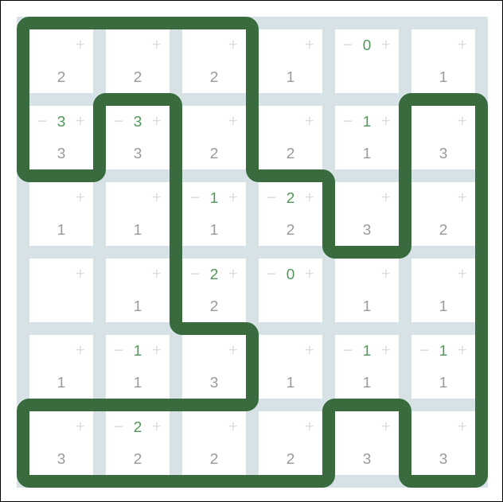

# Loopy

## An implementation of the Loopy game, also known as Slitherlink,
Takegaki, Fences, and Loop the Loop

This is a solution verifier for Loopy. The rules of the game are described
by Simon Tatham:

http://www.chiark.greenend.org.uk/~sgtatham/puzzles/doc/loopy.html#loopy

Wikipedia has an extensive analysis:

https://en.wikipedia.org/wiki/Slitherlink

If the game seems hard, you're right. It has been shown to be NP-complete.

